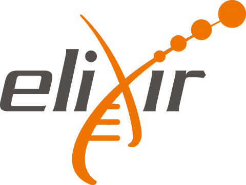

# ELIXIR FONDUE Datathon 

Outline workshop data submission EBI

## Program
* [Day 1 - Tuesday, 15 June 2021](program/day1.md)

  * Introduction
  * BioSamples
  * European Nucleotide Archive
  * European Variation Archive

* [Follow up - Thursday, 17 June 2021](program/followup.md)
  
  * ...

* [Day 2 - Monday, 21 June 2021](program/day2.md)

  * Welcome
  * Evaluation

---

You can [subscribe](https://forms.gle/uSA4kMX5GnG4L9E46) to this workship until **\[end-date subscription\]**

More on data submission to these databases can be found [here](program/links.md)
