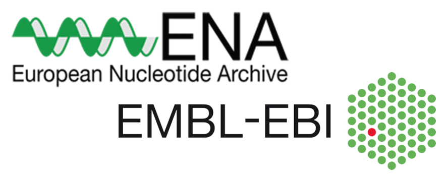

# Day 1 - Tuesday, 15 June 2021
## introduction; processing, validating and submitting data

### Martijn/Matthijs (30 minutes)
* Welcome & introduction
* Quick introduction round of all attendees
* Workshop schedule / agenda
* [create user-accounts](https://ena-docs.readthedocs.io/en/latest/submit/general-guide/registration.html)

***
### Guest speaker 1 (__ELIXIR__) (10 minutes)
* FONDUE - FAIR-ification of Plant Genotyping Data and its linking to Phenotyping using ELIXIR Platforms
***

### Guest speaker 2 (__BIOSAMPLES__) (30 minutes)
* Introduction on BIOSAMPLES
* Plant ontology
* MIAPPE
* Describe / validate test-data
* Experiment (meta)-data
* Sample metadata
* Submitting test data
* Show/use test-server 

### Submitting data to __BIOSAMPLES__ (30-60 minutes)
##### (*supervisor BIOSAMPLES expert*)
* Check & validate data workshop attendees
* Discussion / evaluation
* Finishing
***
#### Short break (15 minutes)
***

### Guest speaker 3, __European Nucleotide Archive__ (__ENA__) (30 minutes)
* Introduction on the ENA
* Determine workflow
* Describe / validate test-data 
* Experiment (meta)-data
* Sample metadata
* Submitting test data
* Show/use test-server 
* CLI and interactive submission

### Submitting data to __ENA__ (30-60 minutes)
##### (_supervisor ENA expert_)
* Check & validate data workshop attendees
* Discussion / evaluation
* Finishing 
***
#### short break (15 minutes)
***

### Guest speaker 4, __European Variation Archive__ (EVA) (30 minutes)
* Introduction on the EVA
* Determine workflow
* Describe / validate test-data 
* Experiment (meta)-data
* Sample metadata
* Submitting test data
* Show/use test-server 

### Submitting data to __EVA__ (30-60 minutes)
##### (_supervisor EVA expert_)
* Check & validate data workshop attendees
* Discussion / evaluation
* Dinishing 
***
### Closing day 1 (Martijn/Matthijs) (15-30 minutes)
* Discussion / evaluation
* Closing
