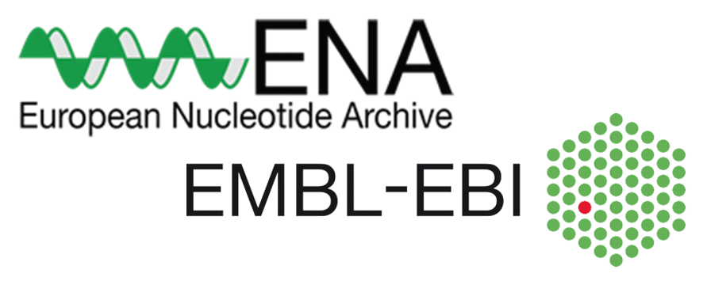

# Day 1 - Tuesday, 15 June 2021, 10:00 - 13:00 (CEST)
## introduction; processing, validating and submitting data

### 10:00 - 10:10 : Welcome
*Martijn van Kaauwen (WUR, Wageningen) / Matthijs Brouwer (WUR, Wageningen)*
- Quick introduction round of all attendees
- Workshop schedule / agenda

---

### 10:10 - 10:30 : Introduction to the ELIXIR Implementation Study FONDUE
*Sebastian Beier (IPK, Gatersleben)*
- ELIXIR
- FONDUE - FAIR-ification of Plant Genotyping Data and its linking to Phenotyping using ELIXIR Platforms
- Bad examples
- MIAPPE and ISA-Tab
- VCF
- Workflow proposal

---

### 10:30 - 11:00 : Lecture about __BioSamples__
*Fuqi Xu (EBI BioSamples)*
- Introduction to BioSamplesw
- Checklists and data validation in BioSamples
- Linking samples metadata with data

### 11:00 - 11:30 : Submitting data to __BioSamples__
*Isuru Liyanage (EBI BioSamples)*
- Information about test data
- Data submission demo
- Data validation demo
- Discussion and evaluation
---

### 11:30 - 11:45 : Short break

---

###  11:45 - 12:15 : Lecture about __European Nucleotide Archive__ (__ENA__)
*Sam Holt (EBI ENA)*
- Introduction to ENA
- Determine workflow
- Describe / validate test-data 
- Experiment (meta)-data
- Sample metadata
- Submitting test data
- Show/use test-server 
- CLI and interactive submission

### 12:15 - 12:45 Submitting data to __ENA__
*Sam Holt (EBI ENA)*
- Check & validate data workshop attendees
- Discussion / evaluation
- Finishing 

---

### 12:45 - 13:00 Closing day 1
*Martijn van Kaauwen (WUR, Wageningen) / Matthijs Brouwer (WUR, Wageningen)*
* Discussion / evaluation
* Closing
