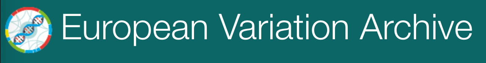

# Day 2 - Monday, 21 June 2021
## evaluation and discussion

### 10:00 - 10:10 : Welcome & introduction
*Martijn van Kaauwen (WUR, Wageningen) / Matthijs Brouwer (WUR, Wageningen)*

---

### [time] : Evalution submitting own data to BioSamples and ENA
##### (_expert_)

---

### [time] : Ontologies
##### (_expert_)

---

###  [time] : Lecture about __European Variation Archive__ (EVA)
*Baron Koylass (EBI EVA)*
* Introduction to EVA
* Determine workflow
* Describe / validate test-data 
* Experiment (meta)-data
* Sample metadata
* Submitting test data
* Show/use test-server 

### [time] : Submitting data to __EVA__ 
##### (_supervisor EVA expert_)
* Check & validate data workshop attendees
* Discussion / evaluation
* Finishing 

---

### [time] Closing day 2
*Martijn van Kaauwen (WUR, Wageningen) / Matthijs Brouwer (WUR, Wageningen)*
* Discussion / evaluation
* Closing

